# HW401 Documentation Hub
> **Warfare in the Fifth Domain**  
> Strategic cyber conflict, cognitive-domain operations, information superiority, and critical infrastructure security.

---

> **Naming convention:** all documentation filenames and page links should use lowercase for cleaner GitHub paths and consistency across the repo.

---

## Mission Snapshot

HW401 explores how cyber operations generate **strategic**, **operational**, and **cognitive** effects across modern conflict environments. This documentation hub is the main navigation layer for course material, instructor resources, student guidance, frameworks, case studies, and repository operations.

### What this hub gives you
- Fast access to **course structure**
- Curated entry points for **instructors** and **students**
- Core **frameworks** for explaining the fifth domain
- Expandable **case-study pathways**
- Clean navigation for **repo contributors**

---

## Quick Navigation

| Area | Purpose | Go |
|---|---|---|
| **Course** | Core structure, outcomes, assessment | [Open Course Docs](#course) |
| **Frameworks** | Conceptual models and theory | [Open Frameworks](#frameworks) |
| **Instructor** | Facilitation, demos, delivery support | [Open Instructor Docs](#instructor) |
| **Student** | Learning support and study guidance | [Open Student Docs](#student) |
| **References** | Glossary, reading, case-study register | [Open References](#references) |
| **Case Studies** | Applied cyber conflict examples | [Open Case Studies](#case-studies) |
| **Repository Ops** | Contribution and documentation standards | [Open Repo Operations](#repository-operations) |

---

## Visual Course Map

```mermaid
flowchart TD
    A[HW401 Documentation Hub] --> B[Course]
    A --> C[Frameworks]
    A --> D[Instructor]
    A --> E[Student]
    A --> F[References]
    A --> G[Case Studies]
    A --> H[Repository Operations]

    B --> B1[Course Overview]
    B --> B2[Module Outline]
    B --> B3[Learning Outcomes]
    B --> B4[Assessment Strategy]

    C --> C1[Cognitive Domain Framework]
    C --> C2[Dimensions of Cyberspace]
    C --> C3[Information Dominance Model]
    C --> C4[Decision-Loop Disruption]
    C --> C5[Influence Propagation]

    D --> D1[Instructor Guide]
    D --> D2[Facilitation Playbook]
    D --> D3[Live Demo Guide]
    D --> D4[Slide Transcript Strategy]

    E --> E1[Student Guide]
    E --> E2[Study Guide]
    E --> E3[Discussion Prompts]

    F --> F1[Glossary]
    F --> F2[Reading List]
    F --> F3[Case Study Register]

    G --> G1[Stuxnet]
    G --> G2[NotPetya]
    G --> G3[Ukraine Power Grid]
    G --> G4[SolarWinds]
    G --> G5[Colonial Pipeline]
    G --> G6[Shamoon]
    G --> G7[BlackEnergy]
    G --> G8[Industroyer]
    G --> G9[WannaCry]
    G --> G10[Moonlight Maze]

    H --> H1[Contributing]
    H --> H2[Documentation Style Guide]
    H --> H3[Roadmap]
    H --> H4[Repository Conventions]
    H --> H5[Pull Request Template]
```

---

## Course

<table>
<tr>
<td width="50%">

### Foundation
- [Course Overview](course/course-overview.md)
- [Module Outline](course/module-outline.md)

</td>
<td width="50%">

### Performance
- [Learning Outcomes](course/learning-outcomes.md)
- [Assessment Strategy](course/assessment-strategy.md)

</td>
</tr>
</table>

> **Best starting point:** Begin with **Course Overview**, then move to **Module Outline** before diving into the frameworks.

---

## Frameworks

These pages provide the conceptual architecture for the course.

- [Cognitive Domain Framework](frameworks/cognitive-domain-framework.md)
- [Dimensions of Cyberspace](frameworks/dimensions-of-cyberspace.md)
- [Information Dominance Model](frameworks/information-dominance-model.md)
- [Decision-Loop Disruption](frameworks/decision-loop-disruption.md)
- [Influence Propagation](frameworks/influence-propagation.md)

<strong>Why these frameworks matter</strong>

These models help connect:
- cyber activity to decision advantage
- data manipulation to cognitive effect
- infrastructure disruption to strategic messaging
- information operations to real-world operational outcomes

---

## Instructor

Designed for facilitation, delivery flow, discussion depth, and live demonstration support.

- [Instructor Guide](instructor/instructor-guide.md)
- [Facilitation Playbook](instructor/facilitation-playbook.md)
- [Live Demo and Browsing Guide](instructor/live-demo-browsing-guide.md)
- [Slide Transcript Strategy](instructor/slide-transcript-strategy.md)

<strong>Recommended instructor workflow</strong>

1. Review the **Module Outline**
2. Read the related **Frameworks**
3. Use the **Instructor Guide** for delivery flow
4. Pull in live examples from the **Demo and Browsing Guide**
5. Use **Slide Transcript Strategy** to standardize talk tracks

---

## Student

Built to support comprehension, revision, reflection, and discussion.

- [Student Guide](student/student-guide.md)
- [Study Guide](student/study-guide.md)
- [Discussion Prompts](student/discussion-prompts.md)

> **Student path:** Start with the **Student Guide**, reinforce understanding through the **Study Guide**, and deepen analysis through **Discussion Prompts**.

---

## References

Use these pages to anchor terminology, source material, and case-study navigation.

- [Glossary](references/glossary.md)
- [Reading List](references/reading-list.md)
- [Case Study Register](references/case-study-register.md)

---

## Case Studies

### Core Case Studies
- [STUXNET](case-studies/stuxnet.md)
- [NOTPETYA](case-studies/notpetya.md)
- [UKRAINE POWER GRID](case-studies/ukraine-power-grid.md)
- [SOLARWINDS](case-studies/solarwinds.md)
- [COLONIAL PIPELINE](case-studies/colonial-pipeline.md)

### Expanded Case Studies
- [SHAMOON](case-studies/shamoon.md)
- [BLACKENERGY](case-studies/blackenergy.md)
- [INDUSTROYER](case-studies/industroyer.md)
- [WANNACRY](case-studies/wannacry.md)
- [MOONLIGHT MAZE](case-studies/moonlight-maze.md)

<strong>Suggested teaching sequence</strong>

- Start with **Moonlight Maze** for cyber espionage foundations
- Move to **Stuxnet** for cyber-physical effect
- Use **Ukraine Power Grid**, **BlackEnergy**, and **Industroyer** for infrastructure disruption
- Use **WannaCry** and **NotPetya** for scale and systemic disruption
- Use **SolarWinds** for supply-chain compromise
- Use **Colonial Pipeline** for operational dependence and business continuity
- Use **Shamoon** for destructive wiper logic

---

## Repository Operations

For contributors, maintainers, and documentation builders.

- [Contributing Guide](repo/contributing.md)
- [Documentation Style Guide](repo/documentation-style-guide.md)
- [Roadmap](repo/roadmap.md)
- [Repository Conventions](repo/repository-conventions.md)
- [Pull Request Template](repo/pull-request-template.md)

---

## Suggested Additions

To make this hub even stronger, the next recommended docs are:

- `TALLINN-MANUAL.md`
- `CYBER-DETERRENCE.md`
- `OODA-IN-CYBER.md`
- `ICS-vs-IT.md`
- `DISINFORMATION-OPERATIONS.md`

---

## Maintainer Notes

This page is designed to function as a **professional landing page** for the documentation set. It uses:

- shield badges for visual hierarchy
- a Mermaid diagram for graphical structure
- tables for clean sectional layout
- expandable sections for a more interactive reading experience
- guided pathways for instructors and students

---

**HW401 · Documentation Hub · Fifth Domain Studies**

