# HW401 Documentation Hub
> **Warfare in the Fifth Domain**  
> Strategic cyber conflict, cognitive-domain operations, information superiority, and critical infrastructure security.

<div align="center">
  
  
  
  
  
  
</div>

---

<div align="center">

## Strategic Documentation for Cyber Conflict Education

A structured course and reference hub for exploring cyber warfare, information operations, state and non-state campaigns, critical infrastructure disruption, and cognitive-domain conflict.

</div>

---

## Overview

**HW401** is a course documentation and teaching repository focused on the **fifth domain of warfare**: cyberspace as a strategic battlespace. The material connects technical cyber activity with operational outcomes, strategic signaling, influence operations, and decision advantage.

This hub acts as the primary entry point for:

- course navigation
- instructional delivery
- student study support
- conceptual frameworks
- applied case studies
- repository standards

---

## Repository Design Principles

> **Naming convention:** all documentation filenames, folders, and page links should use **lowercase** for consistency, portability, and cleaner GitHub paths.

### This hub is designed to be:
- **Readable** for students and instructors
- **Scalable** as more modules and cases are added
- **Contributor-friendly** for repo maintainers
- **Presentation-ready** for live delivery and training use
- **GitHub-native** with clean relative linking and structured navigation

---

## Fast Access Navigation

| Section | Description | Entry Point |
|---|---|---|
| **course** | Learning structure, outcomes, and assessment | [open course docs](#course) |
| **frameworks** | Conceptual models for fifth-domain conflict | [open frameworks](#frameworks) |
| **instructor** | Delivery guides, facilitation, demos, transcripts | [open instructor docs](#instructor) |
| **student** | Study guidance, revision, and discussion support | [open student docs](#student) |
| **references** | Glossary, reading list, and case-study register | [open references](#references) |
| **case studies** | Applied cyber conflict examples and incident analysis | [open case studies](#case-studies) |
| **repository operations** | Contribution standards and repo maintenance | [open repo operations](#repository-operations) |

---

## Documentation Architecture

```mermaid
flowchart TD
    A[hw401 documentation hub] --> B[course]
    A --> C[frameworks]
    A --> D[instructor]
    A --> E[student]
    A --> F[references]
    A --> G[case studies]
    A --> H[repository operations]

    B --> B1[course overview]
    B --> B2[module outline]
    B --> B3[learning outcomes]
    B --> B4[assessment strategy]

    C --> C1[cognitive domain framework]
    C --> C2[dimensions of cyberspace]
    C --> C3[information dominance model]
    C --> C4[decision-loop disruption]
    C --> C5[influence propagation]

    D --> D1[instructor guide]
    D --> D2[facilitation playbook]
    D --> D3[live demo and browsing guide]
    D --> D4[slide transcript strategy]

    E --> E1[student guide]
    E --> E2[study guide]
    E --> E3[discussion prompts]

    F --> F1[glossary]
    F --> F2[reading list]
    F --> F3[case study register]

    G --> G1[stuxnet]
    G --> G2[notpetya]
    G --> G3[ukraine power grid]
    G --> G4[solarwinds]
    G --> G5[colonial pipeline]
    G --> G6[shamoon]
    G --> G7[blackenergy]
    G --> G8[industroyer]
    G --> G9[wannacry]
    G --> G10[moonlight maze]

    H --> H1[contributing]
    H --> H2[documentation style guide]
    H --> H3[roadmap]
    H --> H4[repository conventions]
    H --> H5[pull request template]
```



---

## Mission Snapshot

HW401 examines how cyber operations create:

* **strategic effects** through coercion, signaling, and geopolitical influence
* **operational effects** through service disruption, intelligence gain, and mission degradation
* **cognitive effects** through manipulation of perception, trust, speed, and decision-making
* **infrastructure effects** through compromise of ICS, OT, utilities, logistics, and supply chains

### What this hub enables

* rapid access to course material
* structured teaching flow for instructors
* guided study paths for learners
* reusable models for explaining cyber conflict
* expandable case-study sequencing
* maintainable documentation standards for contributors

---

# Course

<div align="center">

## Core Learning Structure

</div>

| Foundation                                   | Purpose                                                     |
| -------------------------------------------- | ----------------------------------------------------------- |
| [course overview](course/course-overview.md) | Introduces scope, positioning, and rationale for the course |
| [module outline](course/module-outline.md)   | Breaks the course into teachable thematic units             |

| Performance                                          | Purpose                                                               |
| ---------------------------------------------------- | --------------------------------------------------------------------- |
| [learning outcomes](course/learning-outcomes.md)     | Defines measurable learning expectations                              |
| [assessment strategy](course/assessment-strategy.md) | Explains evaluation logic, evidence, and learner performance criteria |

> **Recommended starting path:** begin with **course overview**, continue to **module outline**, then use the frameworks section to support deeper conceptual teaching.

---

# Frameworks

<div align="center">

## Conceptual Models for the Fifth Domain

</div>

These pages provide the theoretical backbone of the course and help connect tactical cyber actions to higher-level military, political, and cognitive outcomes.

* [cognitive domain framework](frameworks/cognitive-domain-framework.md)
* [dimensions of cyberspace](frameworks/dimensions-of-cyberspace.md)
* [information dominance model](frameworks/information-dominance-model.md)
* [decision-loop disruption](frameworks/decision-loop-disruption.md)
* [influence propagation](frameworks/influence-propagation.md)

<details>
<summary><strong>why these frameworks matter</strong></summary>

These frameworks help explain how:

* technical compromise becomes operational leverage
* information control influences human judgment
* cyber disruption affects tempo, trust, and command quality
* perception management alters strategic outcomes
* digital actions extend beyond networks into cognition and behavior

</details>

---

# Instructor

<div align="center">

## Facilitation and Delivery Toolkit

</div>

Built for course facilitators, trainers, and documentation authors who need structured delivery support.

* [instructor guide](instructor/instructor-guide.md)
* [facilitation playbook](instructor/facilitation-playbook.md)
* [live demo and browsing guide](instructor/live-demo-browsing-guide.md)
* [slide transcript strategy](instructor/slide-transcript-strategy.md)

### Recommended instructor workflow

1. Read the [module outline](course/module-outline.md)
2. Review the matching pages under [frameworks](#frameworks)
3. Use the [instructor guide](instructor/instructor-guide.md) to shape session flow
4. Pull current examples from the [live demo and browsing guide](instructor/live-demo-browsing-guide.md)
5. Standardize narration using the [slide transcript strategy](instructor/slide-transcript-strategy.md)

<details>
<summary><strong>instructor focus areas</strong></summary>

A strong instructor experience in HW401 should emphasize:

* strategic framing, not just technical events
* case comparison across espionage, disruption, influence, and sabotage
* cognitive effects such as hesitation, misperception, panic, and trust erosion
* the relationship between cyber operations and real-world organizational dependency
* disciplined use of terminology across military, policy, and cybersecurity contexts

</details>

---

# Student

<div align="center">

## Study, Reflection, and Discussion Support

</div>

Built to reinforce understanding, enable revision, and support structured discussion.

* [student guide](student/student-guide.md)
* [study guide](student/study-guide.md)
* [discussion prompts](student/discussion-prompts.md)

### Recommended student learning path

1. Start with the [student guide](student/student-guide.md)
2. Consolidate concepts using the [study guide](student/study-guide.md)
3. Deepen analysis through [discussion prompts](student/discussion-prompts.md)
4. Cross-reference concepts with the [glossary](references/glossary.md)
5. Apply theory using the [case studies](#case-studies)

---

# References

<div align="center">

## Terminology, Reading, and Evidence Support

</div>

Use these pages to anchor terminology, source material, and structured case-study discovery.

* [glossary](references/glossary.md)
* [reading list](references/reading-list.md)
* [case study register](references/case-study-register.md)

### Reference use cases

| Resource                | Best Use                                               |
| ----------------------- | ------------------------------------------------------ |
| **glossary**            | Standardize terminology across lessons and submissions |
| **reading list**        | Extend theory and support academic grounding           |
| **case study register** | Track incidents, patterns, and teaching relevance      |

---

# Case Studies

<div align="center">

## Applied Cyber Conflict Analysis

</div>

These case studies connect abstract concepts to real-world incidents across espionage, critical infrastructure disruption, destructive malware, ransomware, and supply-chain compromise.

## Core Case Studies

| Case                   | Primary Focus                                    | Link                                       |
| ---------------------- | ------------------------------------------------ | ------------------------------------------ |
| **stuxnet**            | cyber-physical sabotage                          | [open](case-studies/stuxnet.md)            |
| **notpetya**           | systemic disruption and destructive propagation  | [open](case-studies/notpetya.md)           |
| **ukraine power grid** | infrastructure disruption and power operations   | [open](case-studies/ukraine-power-grid.md) |
| **solarwinds**         | supply-chain compromise and stealth access       | [open](case-studies/solarwinds.md)         |
| **colonial pipeline**  | business interruption and operational dependency | [open](case-studies/colonial-pipeline.md)  |

## Expanded Case Studies

| Case               | Primary Focus                         | Link                                   |
| ------------------ | ------------------------------------- | -------------------------------------- |
| **shamoon**        | destructive wiper operations          | [open](case-studies/shamoon.md)        |
| **blackenergy**    | intrusion and grid-related operations | [open](case-studies/blackenergy.md)    |
| **industroyer**    | ICS-targeted disruption               | [open](case-studies/industroyer.md)    |
| **wannacry**       | ransomware at global scale            | [open](case-studies/wannacry.md)       |
| **moonlight maze** | long-term strategic espionage         | [open](case-studies/moonlight-maze.md) |

<details>
<summary><strong>suggested teaching sequence</strong></summary>

A strong sequence for instructional progression is:

1. **moonlight maze** for early cyber espionage foundations
2. **stuxnet** for cyber-physical effect and covert sabotage
3. **ukraine power grid**, **blackenergy**, and **industroyer** for infrastructure disruption
4. **wannacry** and **notpetya** for scale, spread, and systemic consequence
5. **solarwinds** for supply-chain access and strategic stealth
6. **colonial pipeline** for operational dependency and business continuity
7. **shamoon** for destructive intent and organizational paralysis

</details>

---

# Repository Operations

<div align="center">

## Standards for Maintainers and Contributors

</div>

These pages support repo consistency, collaboration, and controlled documentation growth.

* [contributing guide](repo/contributing.md)
* [documentation style guide](repo/documentation-style-guide.md)
* [roadmap](repo/roadmap.md)
* [repository conventions](repo/repository-conventions.md)
* [pull request template](repo/pull-request-template.md)

### Repository rules at a glance

| Rule          | Standard                               |
| ------------- | -------------------------------------- |
| filenames     | lowercase only                         |
| links         | lowercase relative paths               |
| page style    | consistent heading hierarchy           |
| structure     | predictable section ordering           |
| case studies  | use common analysis template           |
| pull requests | include summary, rationale, and impact |

---

# Suggested Next Additions

To strengthen the hub and deepen the strategic framing of the course, the next recommended pages are:

* [tallinn manual](frameworks/tallinn-manual.md)
* [cyber deterrence](frameworks/cyber-deterrence.md)
* [ooda in cyber](frameworks/ooda-in-cyber.md)
* [ics vs it](frameworks/ics-vs-it.md)
* [disinformation operations](frameworks/disinformation-operations.md)

> These additions would improve the bridge between legal interpretation, deterrence theory, operational tempo, infrastructure context, and information influence.

---

# Recommended Future Enhancements

## Navigation Enhancements

* add a top-level **table of contents**
* add **back-to-hub** links inside every document
* add **previous / next** navigation between case studies
* add **module tags** or **topic labels** for cross-linking

## Content Enhancements

* standardize all case studies with:

  * overview
  * timeline
  * actors
  * methods
  * effects
  * strategic implications
  * cognitive implications
  * instructor notes
* add visual comparison matrices across incidents
* add learner self-check or reflection prompts at the end of major pages

## Repo Experience Enhancements

* add a docs-only GitHub Actions workflow for:

  * lowercase filename enforcement
  * broken link checking
  * markdown linting
  * Mermaid validation where possible
* add badges for:

  * link health
  * docs lint
  * last updated
  * contribution readiness

---

# Maintainer Notes

This page is intended to serve as a **professional documentation landing page** for the HW401 repository.

It uses:

* badge-driven visual hierarchy
* structured sectioning
* Mermaid-based architecture mapping
* tables for clean navigation
* expandable sections for progressive disclosure
* guided pathways for instructors and students
* contributor-aware standards for long-term maintainability

---

## Quick Start Paths

### For instructors

Read:

1. [course overview](course/course-overview.md)
2. [module outline](course/module-outline.md)
3. [cognitive domain framework](frameworks/cognitive-domain-framework.md)
4. [instructor guide](instructor/instructor-guide.md)

### For students

Read:

1. [student guide](student/student-guide.md)
2. [study guide](student/study-guide.md)
3. [glossary](references/glossary.md)
4. one case study from [case studies](#case-studies)

### For contributors

Read:

1. [contributing guide](repo/contributing.md)
2. [documentation style guide](repo/documentation-style-guide.md)
3. [repository conventions](repo/repository-conventions.md)

---

<div align="center">

## HW401 · documentation hub · fifth domain studies

**structured learning · strategic cyber conflict · applied case analysis**

</div>
```

I can also generate a **premium GitHub README version with a clickable table of contents and a case-study matrix**.
